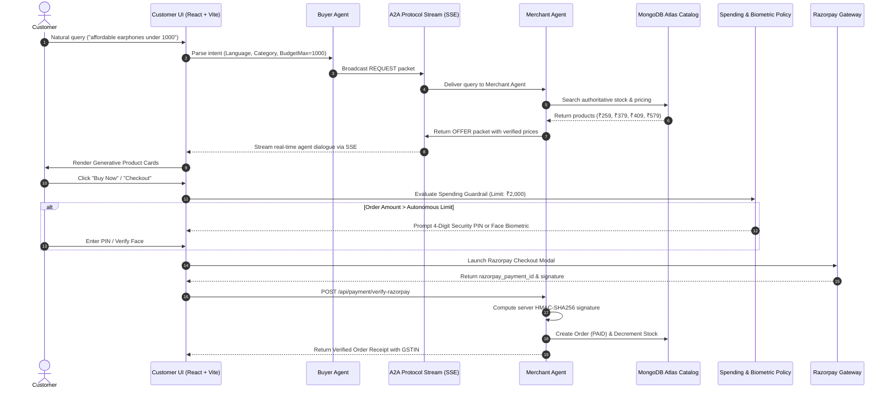

<div align="center">

# 🛒 NexCommerce
### Autonomous Multi-Agent Commerce & Merchant Revenue Growth Platform

[](https://ai-growth-and-agentic-commerce-fron.vercel.app/)
[](https://www.typescriptlang.org/)
[](https://nodejs.org/)
[](https://reactjs.org/)
[](https://vitejs.dev/)
[](https://tailwindcss.com/)
[](https://www.mongodb.com/)
[](https://razorpay.com/)
[](https://ai.google.dev/)
[](LICENSE)
[](.github/workflows/ci.yml)

<p align="center">
  <strong>"Autonomous AI-Native Commerce & Merchant Revenue Growth Platform"</strong><br>
  Built by <strong>Adhvithi Komireddy</strong>
</p>

<p align="center">
  🌐 <strong>Live Production URL:</strong> <a href="https://ai-growth-and-agentic-commerce-fron.vercel.app/" target="_blank">https://ai-growth-and-agentic-commerce-fron.vercel.app/</a>
</p>

[Live Demo](https://ai-growth-and-agentic-commerce-fron.vercel.app/) • [Key Features](#-key-features) • [System Architecture](#-system-architecture) • [Technology Stack](#-technology-stack) • [A2A Protocol](#-agent-to-agent-a2a-protocol) • [API Reference](#-complete-api-reference) • [Getting Started](#-getting-started) • [Deployment](#-production-deployment--high-availability)

</div>

---

## 📑 Table of Contents

1. [Executive Summary](#-executive-summary)
2. [Key Features](#-key-features)
3. [System Architecture & Agent Topology](#-system-architecture--agent-topology)
4. [Technology Stack Detailed Inventory](#-technology-stack-detailed-inventory)
5. [Deep Dive into Core Subsystems](#-deep-dive-into-core-subsystems)
   - [A. Agent-to-Agent (A2A) Protocol & SSE Stream](#a-agent-to-agent-a2a-protocol--sse-stream)
   - [B. Multi-Lingual Natural Language Shopping & Intent Parser](#b-multi-lingual-natural-language-shopping--intent-parser)
   - [C. 1,000+ Unique Authentic Product Catalog + Sub-₹1,000 Affordable Range](#c-1000-unique-authentic-product-catalog--sub-1000-affordable-range)
   - [D. Dynamic Campaign Suggestion & Merchant Revenue Engine](#d-dynamic-campaign-suggestion--merchant-revenue-engine)
   - [E. Razorpay Payment Gateway & Cryptographic Verification](#e-razorpay-payment-gateway--cryptographic-verification)
   - [F. Spending Guardrails & Biometric Liveness Verification (DPDP & RBI)](#f-spending-guardrails--biometric-liveness-verification-dpdp--rbi)
   - [G. Application-Wide Dark Mode & Generative UI](#g-application-wide-dark-mode--generative-ui)
   - [H. Crash-Proof Reliability (React Error Boundary & Process Guards)](#h-crash-proof-reliability-react-error-boundary--process-guards)
6. [Complete API Reference](#-complete-api-reference)
7. [Directory Structure](#-directory-structure)
8. [Getting Started & Installation](#-getting-started)
9. [Environment Configuration](#-environment-configuration)
10. [Production Deployment & High Availability](#-production-deployment--high-availability)
11. [Contributing & Governance](#-contributing--governance)
12. [License](#-license)

---

## 💡 Executive Summary

Traditional e-commerce forces customers through rigid filters, categories, and keyword searches, while merchants struggle to convert interest into larger basket sizes without expensive external ads. At the same time, the emergence of AI agent ecosystems requires merchants to expose machine-readable commerce capabilities so external AI buyer agents can discover, verify, negotiate, and transact directly with merchant systems.

**NexCommerce** bridges this divide with an end-to-end, production-ready, full-stack agentic commerce platform:
1. **Making Merchants AI-Readable & Sellable**: Exposing structured, authoritative AI-readable catalog capabilities (`/api/agent/catalog/*`) with real-time stock verification and policy-bounded negotiation.
2. **Growing Merchant Revenue Proactively**: A private **Merchant AI Orchestrator** continuously analyzes inventory velocity, co-purchase patterns, and cart drop-offs, surfacing high-impact revenue opportunities (cross-sells, upsells, and bundles) that merchants can approve with a single click to activate live promotions.
3. **Frictionless Multilingual Commerce**: Customers shop naturally in **English**, **हिन्दी (Hindi)**, and **తెలుగు (Telugu)** without having to understand APIs, agent protocols, or complex filters.
4. **Deterministic Security & Authoritative Money Actions**: An AI Firewall and Spending Policy Engine enforce human-in-the-loop authorization thresholds, re-validating authoritative database pricing before initiating **Razorpay TEST MODE** payments with server-side HMAC-SHA256 signature verification.

---

## ✨ Key Features

- 🤖 **Autonomous Agent-to-Agent (A2A) Commerce**: Dedicated Buyer Agent and Merchant Agent communicating via structured, typed JSON packets streamed in real-time via Server-Sent Events (SSE).
- 🧠 **Dynamic AI Campaign Suggestion Engine**: Server-side intelligence engine that analyzes live product velocity, margins, and affinities to propose 4 strategic campaign archetypes (Flash Clearances, Ecosystem Bundles, Category Surge Events, and Cart Cross-Sells).
- 🔄 **Working "Refresh Intelligence"**: Instant store intelligence recalculation with animated spinning indicator, live KPI metrics refresh, and dynamic revenue opportunity generation.
- 🌓 **Application-Wide Dark Mode**: Sleek Light/Dark theme engine with localStorage persistence, HTML root class synchronization, custom glowing ambient gradients, and sun/moon toggles in navigation, merchant portal, and settings.
- 💰 **Comprehensive Price Spectrum (₹199 to ₹1,49,900)**: Over **1,000+ authentic products** across 10 categories, each with a 100% unique, verified image URL, including **122 sub-₹1,000 budget essentials** (earphones, cables, accessories, kitchen gadgets).
- 🗣️ **Multilingual AI Shopping**: Full support for English, Hindi, and Telugu conversational queries with automatic budget ceiling detection (`"affordable"` $\rightarrow$ `budgetMax: 1000`).
- 💳 **Razorpay Checkout & Cryptographic HMAC Verification**: Pre-payment stock and price revalidation in paise, Razorpay modal launch, strict payment failure recovery, and server-side HMAC-SHA256 signature verification.
- 🛡️ **AI Spending Guardrails & Biometric Liveness**: Autonomous spending threshold, 4-digit security PIN verification, zero-card retention (DPDP Act 2023), and 3D facial liveness verification.
- 🛡️ **Crash-Proof Reliability**: React Error Boundary for seamless UI self-healing and Node.js process-level uncaught exception guards for 24/7 high availability.

---

## 🏗️ System Architecture & Agent Topology

```
                                  CUSTOMER
                                     │
                   Natural Language (EN / HI / TE)
                                     ▼
                                BUYER AGENT
                                     │
                         Structured A2A Messages
                                     ▼
                           A2A PROTOCOL LAYER
                     (Typed JSON, Validation, SSE)
                                     ▲
                         Structured A2A Responses
                                     │
                              MERCHANT AGENT
                                     │
                          Authoritative Capabilities
                                     ▼
                           AI-READABLE CATALOG
                     (Endpoints: capabilities, search,
                      trending, related, compatible)
                                     ▲
                                     │ Analyzes Velocity,
                                     │ Affinity & Inventory
                                     │
                         MERCHANT AI ORCHESTRATOR
                            (Merchant-Private)
                                     │
                     ┌───────────────┴───────────────┐
                     ▼                               ▼
               MERCHANT PORTAL               CAMPAIGN ENGINE
           (Live KPI Metrics, AI           (Dynamic Clearance,
            Opportunity Approval)           Bundles, Cross-Sells)
```



---

## 🧰 Technology Stack Detailed Inventory

| Layer / Subsystem | Technology | Version | Purpose |
| :--- | :--- | :--- | :--- |
| **Frontend Framework** | React | `18.3.1` | Component-based interactive user interface |
| **Frontend Tooling** | Vite | `6.2.0` | Ultra-fast build tool and hot module replacement |
| **Type System** | TypeScript | `5.8.2` | End-to-end static typing and schema verification |
| **Styling & UI** | Tailwind CSS | `3.4.17` | Utility-first responsive design with dark mode |
| **Icons & Assets** | Lucide React | `0.475.0` | Modern, clean vector iconography |
| **Backend Runtime** | Node.js | `20.x` | High-performance asynchronous JavaScript runtime |
| **Web Framework** | Express | `4.21.2` | RESTful API routing, middleware, and SSE streaming |
| **Database & ODM** | MongoDB Atlas / Mongoose | `8.12.1` | Cloud-persistent NoSQL database and schema modeling |
| **AI LLM Model** | Google Gemini | `2.5-flash` | Natural language understanding and conversational reasoning |
| **AI NLP Engine** | Custom Deterministic Parser | `Internal` | Zero-latency, offline-capable intent and budget parser |
| **Payment Gateway** | Razorpay Node SDK | `2.9.6` | Order creation, payment capture, and signature verification |
| **Security Headers** | Helmet | `8.0.0` | HTTP security headers and CORS origin validation |
| **Rate Limiting** | Express Rate Limit | `7.5.0` | Denial-of-service and brute-force protection |
| **Authentication** | JSON Web Tokens & bcryptjs | `9.0.2` / `3.0.2` | Stateless bearer token authentication and password hashing |
| **Schema Validation** | Zod | `3.24.2` | Type-safe runtime request payload validation |
| **Process Resilience** | React ErrorBoundary & Node Guards | `Custom` | Self-healing crash protection on frontend and backend |

---

## 🔬 Deep Dive into Core Subsystems

### A. Agent-to-Agent (A2A) Protocol & SSE Stream
- **Logical Agent Separation**: Real structural separation between the **Buyer Agent** (customer advocate) and the **Merchant Agent** (store guardian).
- **A2APacket Schema**: Typed communication format:
  ```typescript
  interface A2APacket {
    packetId: string;
    conversationId: string;
    sender: "BUYER_AGENT" | "MERCHANT_AGENT" | "ORCHESTRATOR";
    recipient: "BUYER_AGENT" | "MERCHANT_AGENT" | "CUSTOMER";
    type: "REQUEST" | "OFFER" | "COUNTER_OFFER" | "ACCEPT" | "REJECT" | "VERIFY";
    payload: Record<string, any>;
    timestamp: string;
    signature?: string;
  }
  ```
- **Real-Time SSE Stream (`GET /api/a2a/stream`)**: Pushes typed agent negotiation steps directly to the customer's UI in real time.

### B. Multi-Lingual Natural Language Shopping & Intent Parser
- Native support for **English**, **हिन्दी (Hindi)**, and **తెలుగు (Telugu)**.
- **Budget Extraction & Price Normalization**:
  - Automatically parses shorthand notations: `"under 1k"` $\rightarrow$ `1000`, `"2.5k"` $\rightarrow$ `2500`.
  - Maps colloquial budget expressions (`"affordable"`, `"cheap"`, `"low cost"`, `"pocket friendly"`, `"సస్తా"`, `"తక్కువ ధర"`, `"सस्ता"`, `"कम दाम"`) to `budgetMax: 1000`.
- **Hybrid Relevance Scoring**: Balances text match relevancy with budget proximity:
  $$\text{Score} = \text{TextMatch} + \max\left(0, \frac{\text{BudgetMax} - \text{Price}}{\text{BudgetMax} / 40}\right)$$

### C. 1,000+ Unique Authentic Product Catalog + Sub-₹1,000 Affordable Range
- **1,000 Core Products across 10 Categories**: Phones, Laptops, Audio, Wearables, Tablets, Gaming, Cameras, SmartHome, Accessories, and Gifts.
- **100% Unique Image Guarantee**: Every catalog product contains a verified, distinct Wikimedia Commons or Unsplash CDN image URL (`distinct("imageUrl").length === 1000`).
- **122 Sub-₹1,000 Budget Items**: Authentic products priced from ₹199 to ₹999 (boAt micro-USB cables ₹259, boAt BassHeads ₹379, Realme Buds ₹579, SanDisk 64GB MicroSD ₹439, Zebronics wireless mouse ₹239).

### D. Dynamic Campaign Suggestion & Merchant Revenue Engine
- **Server-Side Engine (`campaignSuggestionService.ts`)**: Continuously analyzes catalog inventory levels, sales velocity, and product co-views to propose 4 campaign archetypes:
  1. **Inventory Velocity Clearance**: Flags high-stock surplus items and recommends a 15% flash liquidation.
  2. **AI Ecosystem Power Bundle**: Matches flagship devices with complementary audio/peripherals for 10% bundle discounts.
  3. **Category Surge Promotion**: Detects rising query volume across categories and deploys 12% category discounts.
  4. **Instant Checkout Cross-Sell**: Suggests high-converting sub-₹1,000 companion add-ons at cart review.
- **Interactive Approval**: Merchants approve suggestions with 1 click, instantly creating a live `Campaign` record in MongoDB and broadcasting an A2A event.

### E. Razorpay Payment Gateway & Cryptographic Verification
- **Pre-Payment Verification**: Re-checks live stock in MongoDB and calculates the authoritative final total in paise before initiating the Razorpay order.
- **Strict Payment Failure Handling**: Preserves customer cart state and offers one-click retry if Razorpay triggers `payment.failed`.
- **Server-Side HMAC-SHA256 Verification**:
  ```typescript
  const expectedSignature = crypto
    .createHmac("sha256", process.env.RAZORPAY_KEY_SECRET!)
    .update(`${razorpay_order_id}|${razorpay_payment_id}`)
    .digest("hex");
  ```
- **Authoritative Receipts**: Produces downloadable tax receipts with merchant GSTIN (`29AABCU9603R1ZM`), itemized discounts, and transaction IDs.

### F. Spending Guardrails & Biometric Liveness Verification (DPDP & RBI)
- **Autonomous Spending Threshold**: Customers configure an auto-spend ceiling (e.g. ₹2,000). Purchases exceeding this amount trigger a 4-digit security PIN prompt.
- **Biometric 3D Liveness Check**: Client-side optical blinking and depth check for high-value orders.
- **Zero-Card Retention**: Full compliance with India's **DPDP Act 2023** and **RBI Tokenization Guidelines 2022**—card details are never stored on backend servers.
- **UPI VPA Masking**: Masked identifiers (`****@okhdfcbank`) protect buyer privacy in merchant analytics.

### G. Application-Wide Dark Mode & Generative UI
- **Theme Engine (`ThemeContext.tsx`)**: Synchronizes with `<html class="dark">` and persists preferences to `localStorage`.
- **Deep Palette**: Background `#090D11`, Cards `#0F172A`, Borders `#334155`, glowing emerald accents `#22C55E`, and smooth transitions.
- **Theme Toggles**: Accessible Sun ☀️ / Moon 🌙 switchers in Navbar, Merchant Portal, and Settings.

### H. Crash-Proof Reliability (React Error Boundary & Process Guards)
- **React Error Boundary (`ErrorBoundary.tsx`)**: Prevents full-screen white crashes on UI errors and provides a 1-click self-healing session reset.
- **Global Process Guards (`server.ts`)**: `uncaughtException` and `unhandledRejection` handlers capture runtime anomalies, keeping the HTTP server continuously operational.

---

## 📡 Complete API Reference

### 1. Agent Catalog & Discovery (`/api/agent/catalog`)
| Method | Endpoint | Auth | Description |
| :--- | :--- | :--- | :--- |
| `GET` | `/api/agent/catalog/capabilities` | Public | Returns machine-readable AI agent commerce manifest |
| `POST` | `/api/agent/catalog/search` | Public | Structured AI semantic product search with budget & filters |
| `GET` | `/api/agent/catalog/product/:id` | Public | Fetches detailed authoritative product specifications |
| `GET` | `/api/agent/catalog/trending` | Public | Retrieves high-velocity trending items |
| `GET` | `/api/agent/catalog/related/:id` | Public | Retrieves co-viewed and related items |
| `GET` | `/api/agent/catalog/compatible/:id` | Public | Returns compatible companion accessories |

### 2. Standard Catalog & Negotiation (`/api/catalog`)
| Method | Endpoint | Auth | Description |
| :--- | :--- | :--- | :--- |
| `GET` | `/api/catalog` | Public | Lists products with pagination and category filtering |
| `GET` | `/api/catalog/:id` | Public | Retrieves a single product by ID |
| `POST` | `/api/catalog/negotiate` | Optional | Proposes a discount counter-offer within margin bounds |

### 3. Agent-to-Agent Protocol (`/api/a2a`)
| Method | Endpoint | Auth | Description |
| :--- | :--- | :--- | :--- |
| `POST` | `/api/a2a/message` | Optional | Dispatches a structured A2APacket between agents |
| `GET` | `/api/a2a/stream` | Optional | Server-Sent Events (SSE) real-time packet stream |
| `GET` | `/api/a2a/history/:convId` | Optional | Retrieves conversation trajectory audit log |

### 4. Payments & Orders (`/api/payment` & `/api/orders`)
| Method | Endpoint | Auth | Description |
| :--- | :--- | :--- | :--- |
| `POST` | `/api/payment/create-razorpay-order` | Optional | Revalidates pricing and creates Razorpay Order in paise |
| `POST` | `/api/payment/verify-razorpay` | Optional | Verifies HMAC-SHA256 signature and captures payment |
| `GET` | `/api/orders` | Required | Fetches user's order history |
| `GET` | `/api/orders/:id` | Required | Retrieves details of a specific order |
| `GET` | `/api/receipts/:orderId` | Public | Fetches printable tax invoice receipt |

### 5. Merchant Revenue Intelligence (`/api/merchant`)
| Method | Endpoint | Auth | Description |
| :--- | :--- | :--- | :--- |
| `GET` | `/api/merchant/analytics` | Role | Fetches Gross Revenue, AOV, AI Share %, Conversion Rate |
| `GET` | `/api/merchant/opportunities` | Role | Lists pending AI-generated revenue opportunities |
| `POST` | `/api/merchant/refresh-intelligence` | Role | Recalculates metrics and generates fresh AI campaigns |
| `POST` | `/api/merchant/opportunities/:id/approve`| Role | Approves an opportunity and activates live Campaign |
| `POST` | `/api/merchant/opportunities/:id/dismiss`| Role | Dismisses an opportunity |
| `GET` | `/api/merchant/campaigns` | Role | Lists all active and completed promotional campaigns |
| `GET` | `/api/merchant/audit-logs` | Role | Retrieves immutable A2A transaction audit logs |

---

## 📁 Directory Structure

```
ai-growth-and-agentic-commerce/
├── .github/
│   └── workflows/
│       └── ci.yml                     # Continuous Integration workflow
├── backend/
│   ├── scripts/
│   │   ├── populate1000GuaranteedUnique.cjs  # 1,000 unique images seeder
│   │   └── seedAffordableSub1000Products.cjs # Sub-₹1,000 catalog seeder
│   ├── src/
│   │   ├── a2a/                       # Agent-to-Agent Protocol & SSE
│   │   ├── config/                    # Database (Mongoose) & Env config
│   │   ├── controllers/               # API route controllers
│   │   ├── middleware/                # Auth, Rate limiting, Error handling
│   │   ├── models/                    # MongoDB schemas (Product, Order, etc.)
│   │   ├── routes/                    # Express route definitions
│   │   ├── services/                  # Business logic (Catalog, Intent, Campaign)
│   │   ├── utils/                     # Logger and helper utilities
│   │   └── server.ts                  # Server entry point with crash guards
│   ├── package.json
│   └── tsconfig.json
├── frontend/
│   ├── src/
│   │   ├── api/                       # Typed HTTP API client
│   │   ├── components/
│   │   │   ├── checkout/              # Spending controls & Auth modals
│   │   │   ├── common/                # ErrorBoundary, Biometrics modal
│   │   │   ├── customer/              # Navbar, Product cards, Comparison modal
│   │   │   └── ui/                    # Reusable Design System components
│   │   ├── context/                   # Auth, Cart, Language, Theme contexts
│   │   ├── pages/
│   │   │   ├── customer/              # AIShoppingView, Catalog, Cart, Orders, Settings
│   │   │   └── merchant/              # MerchantPortalView (Analytics & Intelligence)
│   │   ├── types/                     # TypeScript shared interfaces
│   │   ├── App.tsx                    # Root Application component
│   │   ├── main.tsx                   # React DOM mount entry
│   │   └── index.css                  # Tailwind styles and dark mode overrides
│   ├── package.json
│   ├── tailwind.config.js             # Tailwind config (darkMode: 'class')
│   └── vite.config.ts
├── docs/                              # Deep-dive architecture and API specifications
├── .env.example                       # Environment template
├── CONTRIBUTING.md                    # Contribution guidelines
├── CODE_OF_CONDUCT.md                 # Contributor covenant
├── SECURITY.md                        # Security policy and vulnerability disclosure
├── LICENSE                            # MIT License
└── package.json                       # Root workspaces package
```

---

## 🚀 Getting Started

### 1. Prerequisites
- **Node.js**: v18.0.0 or higher (v20+ recommended)
- **MongoDB Atlas** connection string or local MongoDB instance
- **Razorpay Test Account** (Key ID & Key Secret from [Razorpay Dashboard](https://dashboard.razorpay.com/))

### 2. Clone the Repository
```bash
git clone https://github.com/adhvithikomireddy/ai-growth-and-agentic-commerce.git
cd ai-growth-and-agentic-commerce
```

### 3. Install Dependencies
```bash
npm install
```

### 4. Configure Environment Variables
Create `backend/.env` (or copy from `.env.example`):
```env
PORT=5000
NODE_ENV=development
CLIENT_URL=http://localhost:5173
MONGODB_URI=mongodb+srv://<username>:<password>@cluster0.mongodb.net/ai_agentic_commerce?retryWrites=true&w=majority
JWT_SECRET=your_jwt_secret_key_minimum_32_characters_long
COOKIE_SECRET=your_cookie_secret_key_minimum_32_characters
RAZORPAY_KEY_ID=rzp_test_yourKeyIdHere
RAZORPAY_KEY_SECRET=yourRazorpaySecretHere
GEMINI_API_KEY=your_gemini_api_key_here
```

### 5. Seed Catalog Products (Optional if already seeded)
```bash
npm run seed --workspace=backend
```

### 6. Start the Development Environment
```bash
# Starts backend on http://localhost:5000 and frontend on http://localhost:5173
npm run dev
```

Open [http://localhost:5173](http://localhost:5173) in your browser.

---

## ⚙️ Environment Configuration

| Variable | Required | Default | Description |
| :--- | :---: | :--- | :--- |
| `PORT` | No | `5000` | Backend HTTP listening port |
| `NODE_ENV` | No | `development` | `development` or `production` |
| `CLIENT_URL` | Yes | `http://localhost:5173` | Allowed frontend origin for CORS |
| `MONGODB_URI` | Yes | - | MongoDB Atlas connection string |
| `JWT_SECRET` | Yes | - | Secret key used for signing JWT auth tokens |
| `COOKIE_SECRET`| Yes | - | Secret key for signed cookie verification |
| `RAZORPAY_KEY_ID` | Yes | - | Razorpay Test/Live API Key ID |
| `RAZORPAY_KEY_SECRET` | Yes | - | Razorpay Test/Live API Secret Key |
| `GEMINI_API_KEY` | Optional | - | Google Gemini AI key (deterministic fallback active if missing) |

---

## 🌐 Production Deployment & High Availability

### Deploying the Backend (Render / Railway / AWS ECS)
1. Build TypeScript:
   ```bash
   npm run build:backend
   ```
2. Start the server with a process supervisor (PM2):
   ```bash
   npm install -g pm2
   pm2 start backend/dist/server.js --name "nexcommerce-api"
   pm2 startup
   pm2 save
   ```

### Deploying the Frontend (Vercel / Cloudflare Pages)
1. Build the Vite production bundle:
   ```bash
   npm run build:frontend
   ```
2. Set the `VITE_API_URL` environment variable to your backend domain (e.g. `https://api.yourdomain.com`).

---

## 🤝 Contributing & Governance

Contributions, bug reports, and feature requests are welcome!
- Please read our [Contributing Guidelines](CONTRIBUTING.md) before opening a pull request.
- Review our [Code of Conduct](CODE_OF_CONDUCT.md).
- Review our [Security Policy](SECURITY.md) for vulnerability reporting.

---

## 📄 License

This project is licensed under the **MIT License** — see the [LICENSE](LICENSE) file for details.

<div align="center">
  <sub>Built with ❤️ by <strong>Adhvithi Komireddy</strong>.</sub>
</div>
